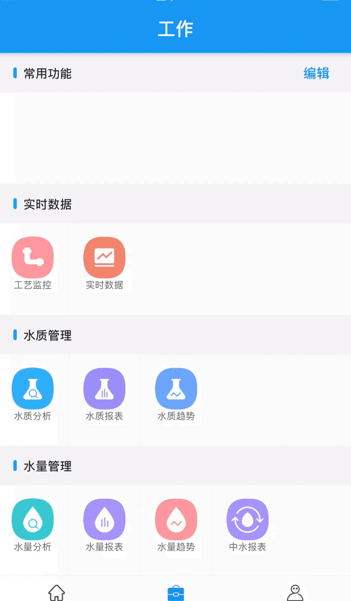

# feature_list_demo

功能清单列表，可以选择作为常用的功能，常用功能支持拖拽排序和本地缓存。

支持在数据源中传入Widget，可以点击某功能直接跳转。

## Getting Started

对外接口只有：[FeatureListPage](lib/work/view/module_list.dart)，需要提供一个必选参数**items**，即数据源。需要注意数据源的格式。另外一个参数**enableEditPermission**默认为false，即没有编辑权限，这个时候不提供选择常用功能的模块。

详细使用方式可以查看：[WorkPage](lib/work/work_page.dart)

## 最终效果



## 感谢
[drag_and_drop_gridview](https://pub.dev/packages/drag_and_drop_gridview)

## LICENSE

```
MIT License

Copyright (c) 2020 windyfat

Permission is hereby granted, free of charge, to any person obtaining a copy
of this software and associated documentation files (the "Software"), to deal
in the Software without restriction, including without limitation the rights
to use, copy, modify, merge, publish, distribute, sublicense, and/or sell
copies of the Software, and to permit persons to whom the Software is
furnished to do so, subject to the following conditions:

The above copyright notice and this permission notice shall be included in all
copies or substantial portions of the Software.

THE SOFTWARE IS PROVIDED "AS IS", WITHOUT WARRANTY OF ANY KIND, EXPRESS OR
IMPLIED, INCLUDING BUT NOT LIMITED TO THE WARRANTIES OF MERCHANTABILITY,
FITNESS FOR A PARTICULAR PURPOSE AND NONINFRINGEMENT. IN NO EVENT SHALL THE
AUTHORS OR COPYRIGHT HOLDERS BE LIABLE FOR ANY CLAIM, DAMAGES OR OTHER
LIABILITY, WHETHER IN AN ACTION OF CONTRACT, TORT OR OTHERWISE, ARISING FROM,
OUT OF OR IN CONNECTION WITH THE SOFTWARE OR THE USE OR OTHER DEALINGS IN THE
SOFTWARE.
```